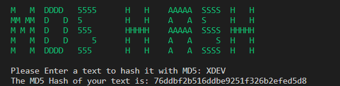

# 🔒 MD5 Hashing Algorithm

### **Introduction**

MD5, which stands for Message Digest Algorithm 5, is a widely used hashing algorithm that produces a 128-bit hash value, typically represented as a 32-character hexadecimal number. Developed by Ronald Rivest in 1991, MD5 was initially designed for cryptographic security but is now considered insecure for cryptographic purposes due to vulnerabilities.

### **Characteristics of MD5**

1. **Speed and Efficiency:** MD5 is known for its speed and efficiency, making it suitable for various applications such as checksums and data integrity verification.
2. **Fixed Output Size:** The MD5 algorithm consistently produces a 128-bit hash, providing a compact representation of data regardless of its size.
3. **Collision Vulnerability:** MD5 is susceptible to collision vulnerabilities, where different inputs may produce the same hash output. This weakness has led to its deprecation in cryptographic contexts.
4. **Common Usage:** While considered insecure for cryptographic purposes, MD5 is still used in non-cryptographic scenarios, such as checksums for file integrity verification.

### **Applications of MD5**

1. **Checksums:** MD5 is commonly used to generate checksums for verifying the integrity of files. If the hash of a downloaded file matches the expected MD5 checksum, it indicates that the file has not been corrupted during the download process.
2. **Password Storage (Historical):** In the past, MD5 was utilized for storing password hashes. However, due to its vulnerabilities, more secure alternatives like bcrypt or SHA-256 are now recommended.

### **Security Considerations**

MD5 is considered deprecated for cryptographic use due to its vulnerability to collision attacks. In 2004, researchers demonstrated the practicality of finding two different inputs that produce the same MD5 hash. Consequently, MD5 is no longer considered secure for applications where data integrity and resistance to tampering are critical.

### CODE

> To access the full version of our code, visit our [**GitHub**](https://github.com/AjaxSX1/CryptoXDEV/blob/main/MD5%20Hash/MD5HashLite.py) repository.

Certainly, let's break down each section of the code and explain why each function or line is used:

#### Importing Libraries:

```python
import hashlib
import termcolor
from termcolor import colored
```

* `hashlib`: This library provides hash functions, including MD5. In this script, it's used to calculate the MD5 hash of the user-provided text.

#### User Input and MD5 Hash Calculation:

```python
plaintext = input("Please Enter a text to hash it with MD5: ")
md5_hashed_text = hashlib.md5(plaintext.encode())
print("The MD5 Hash of your text is:", md5_hashed_text.hexdigest())
```

* `input`: This function prompts the user to enter a text string, and the entered text is stored in the variable `plaintext`.
* `hashlib.md5()`: This function creates an MD5 hash object. The user-provided text (`plaintext`) is encoded to bytes using `encode()` before hashing.
* `hexdigest()`: This method returns the hexadecimal representation of the MD5 hash. The result is printed to the console, displaying the MD5 hash of the entered text.

### Application

* The uniqueness property of MD5 hash values implies that even a small change in the input data will result in a significantly different MD5 hash. This property is known as the avalanche effect.

**Example 01:**

<figure><figcaption></figcaption></figure>

* **Input:** XDEV
* **MD5 Hash:** 76ddbf2b516ddbe9251f326b2efed5d8

**Example 02:**

<figure><figcaption></figcaption></figure>

* **Input:** XDeV (changed 'E' to 'e')
* **MD5 Hash:** 1102c97333c368ae638ae001724cbb41

### **Conclusion**

While MD5 remains relevant in certain non-cryptographic applications, its limitations in the realm of cryptographic security have led to its deprecation in favor of more robust alternatives like SHA-256. Understanding the characteristics, vulnerabilities, and historical context of MD5 empowers users to make informed decisions about its usage in specific scenarios. As the field of cryptography evolves, continuous vigilance is essential to adopt the most secure and resilient hashing algorithms available.
